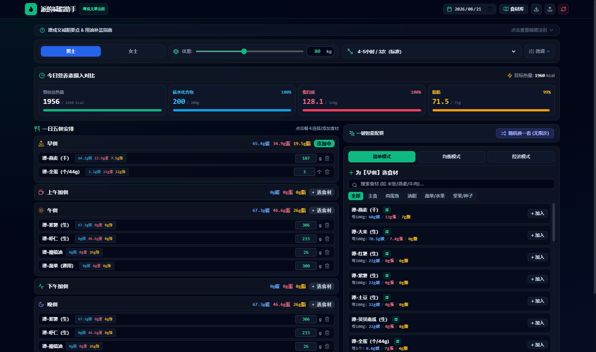
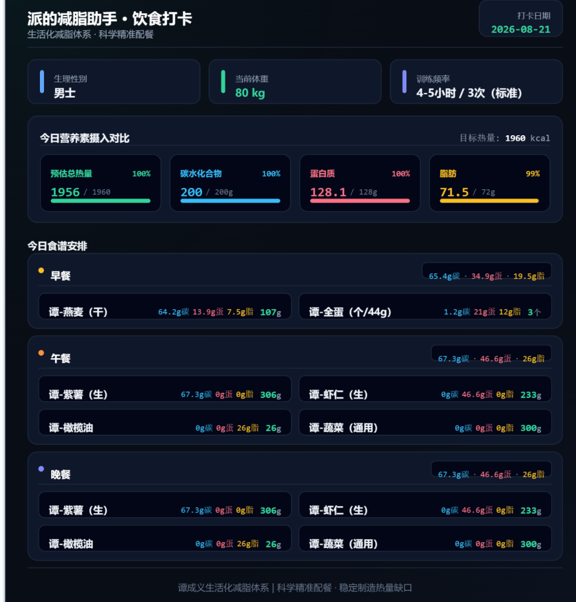

# 🥗 派的减脂助手 (Tan Fat Loss Calculator)
> 理论体系：**谭成义生活化减脂体系 · 科学精准配餐版**

[](https://reactjs.org/)
[](https://www.typescriptlang.org/)
[](https://vitejs.dev/)
[](https://tailwindcss.com/)
[](LICENSE)

---

## 🖼️ 应用预览

### 💻 网页端主操作界面


### 📱 导出的极简打卡海报
<p align="center">
  
</p>

---

## 📖 项目简介

**派的减脂助手** 是一款专为减脂人群量身打造的**生活化精准配餐与营养素计算工具**。

应用深度整合了**谭成义生活化减脂理论**，能够根据用户的生理性别、当前体重及每周训练频率，自动计算每日每日目标热量缺口及碳水化合物、蛋白质、脂肪的三大宏量营养素摄入目标，并提供**一键智能配餐**与**高清极简打卡海报导出**功能。

---

## ✨ 核心特性

### 1. 🎯 精准三大宏量营养素目标计算
- **个性化定制**：基于体重、性别、活动系数动态核算每日基础代谢与总能量消耗（TDEE）；
- **微调机制**：支持碳水、蛋白质、脂肪的自由微调系数，满足每 10 天周期称重后的递进微调。

### 2. ⚡ 一键智能配餐引擎
- **三大智能模式**：
  - 🟢 **简单模式**：精选谭师标准主食（燕麦/大米/红薯）+ 高吸收肉蛋（全蛋/鸡胸/虾仁）+ 推荐优质烹调用油；
  - 🔵 **均衡模式**：荤素均衡搭配，营养丰富；
  - 🟣 **经济模式**：高性价比食材组合，实惠生活化减脂；
- **无限随机换一套**：基于蒙特卡洛启发式配平算法，动态平衡食材自带脂肪与烹调用油，精准贴合每日摄入目标。

### 3. 🍱 一日五餐精细化管理
- 科学划分 **早餐 / 上午加餐 / 午餐 / 下午加餐 / 晚餐**；
- 碳蛋脂营养素与食材同行横向单行流式排版，结构清晰规整；
- 支持自由添加、调整克数/个数、一键删除与换餐。

### 4. 📸 极简高级暗黑科技风海报导出
- 专属离屏渲染引擎，一键生成 2x 超清 PNG 打卡海报；
- 包含打卡日期、身体档案、三大营养素摄入对比 Dashboard 与全天五餐食谱安排；
- 采用非对称 Padding 垂直基线校准技术，确保导出的图片文字与图标在背景框绝对正中对齐。

### 5. 🔒 100% 数据隐私与离线备份
- **零云端上传**：所有身体数据、自定义食材、配餐记录均保存在用户本地浏览器（LocalStorage）；
- **一键备份/还原**：支持 JSON 数据文件的导出与跨设备无缝导入。

---

## 🛠️ 技术栈

- **核心框架**：[React 18](https://reactjs.org/) + [TypeScript](https://www.typescriptlang.org/)
- **构建工具**：[Vite 5](https://vitejs.dev/)
- **样式方案**：[Tailwind CSS](https://tailwindcss.com/)
- **图标组件**：[Lucide React](https://lucide.dev/)
- **海报渲染**：[html2canvas](https://html2canvas.hertzen.com/)

---

## 🚀 本地开发与快速上手

### 1. 克隆项目
```bash
git clone https://github.com/PAIZ1999/tan-fat-loss.git
cd tan-fat-loss
```

### 2. 安装依赖
```bash
npm install
```

### 3. 启动本地开发服务器
```bash
npm run dev
```
打开浏览器访问 [http://localhost:3000](http://localhost:3000) 即可开始使用。

### 4. 生产环境构建
```bash
npm run build
```
打包产物将输出在 `dist` 目录中。

---

## 🌐 部署指南

本项目为纯前端单页应用（SPA），无需购买云服务器和数据库，可直接免费部署到全球静态托管平台：

### 推荐方案：Cloudflare Pages (国内秒开)
1. 登录 [Cloudflare 仪表盘](https://dash.cloudflare.com/)，进入 **Workers 和 Pages**；
2. 选择 **创建** $\rightarrow$ **Pages** $\rightarrow$ **连接到 Git**；
3. 选择 `PAIZ1999/tan-fat-loss` 仓库；
4. 构建配置选择：
   - **Framework Preset**: `Vite`
   - **Build Command**: `npm run build`
   - **Output Directory**: `dist`
5. 点击 **Save and Deploy** 即可全球上线并分配免费 HTTPS 域名！

---

## 📚 谭成义生活化减脂核心要点

1. **宏量平衡**：减脂核心在于维持热量缺口并尽可能保留瘦体重（肌肉量）；
2. **新手规则**：常见绿叶蔬菜、微量生坚果、南瓜籽、蓝莓新手期暂不计算热量；
3. **烹调油脂**：推荐初榨橄榄油、牛油果油、山茶油、低芥酸菜籽油或优质猪油；
4. **科学补盐**：低碳/干净饮食期间，每日建议适量补盐 6~8g，维持体液与电解质平衡；
5. **10天微调周期**：每 10 天清晨空腹称重一次，根据掉秤速率微调碳水系数（过快加碳，停滞适度减碳）。

---

## 📄 开源协议

本项目基于 [MIT License](LICENSE) 开源。欢迎 Star、Fork 与提交 Issue / PR！
